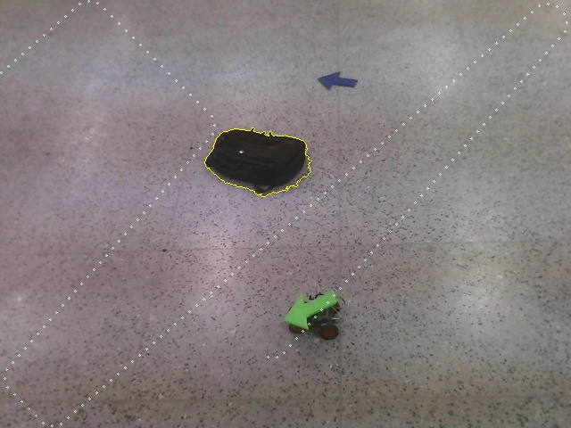

# Artificial Potential Field Motion Planning

Implementation of the **Artificial Potential Field (APF)** reactive method for mobile robot motion planning and obstacle avoidance.

---

## Concept Overview

In Artificial Potential Field planning:
- The **Robot** is modeled as a positively charged particle.
- The **Goal Position** is modeled as an attractive (negatively charged) field.
- **Obstacles** are modeled as repulsive (positively charged) potential fields.

The net potential force vector $\vec{F}_{\text{total}} = \vec{F}_{\text{att}} + \vec{F}_{\text{rep}}$ drives the robot towards the target while steering away from surrounding obstacles.

### Force Formulations

#### Attractive Force
$$\vec{F}_{\text{att}}(q) = \begin{cases} -\tau (q - q_{\text{goal}}), & \text{if } d(q, q_{\text{goal}}) \le d^* \\ -\frac{d^* \cdot \tau (q - q_{\text{goal}})}{d(q, q_{\text{goal}})}, & \text{if } d(q, q_{\text{goal}}) > d^* \end{cases}$$

#### Repulsive Force
$$\vec{F}_{\text{rep}}(q) = \begin{cases} \eta \left(\frac{1}{D(q)} - \frac{1}{Q^*}\right) \frac{1}{D(q)^2} \nabla D(q), & \text{if } D(q) < Q^* \\ 0, & \text{if } D(q) \ge Q^* \end{cases}$$

---

## Sample Visualizations

| Sample Input Frame | Potential Field Planned Output |
|---|---|
|  |  |
|  |  |

---

## Installation & Setup

Clone the repository and install dependencies:

```bash
git clone https://github.com/vampcoder/Artificial-Potential-Field.git
cd Artificial-Potential-Field
pip install -r requirements.txt
```

---

## Execution

Run the potential field motion planning simulations:

```bash
# Main Artificial Potential Field Simulation
python3 Artificial-Potential-final.py

# Potential Field Controller Simulation
python3 Artificial-potential-controller.py
```

---

## License

MIT License
